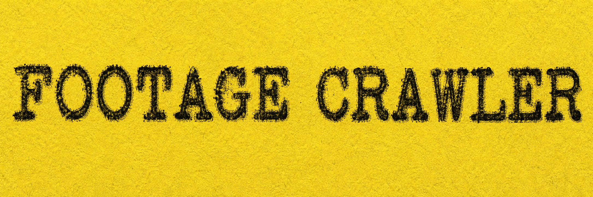
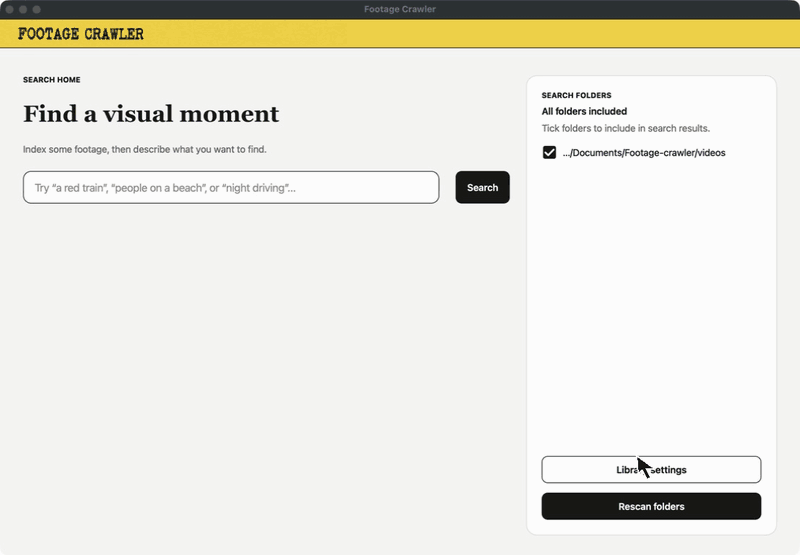

<p align="center">
  <a href="https://youtu.be/C8BsOTAol_o?si=PT3T88u75a3TdKuB&amp;t=1043">
    
  </a>
</p>
<p align="center"><em>Watch the Footage Crawler concept in Van Neistat's video, starting at 17:23.</em></p>

<p align="center">
  
</p>

# Footage Crawler

Footage Crawler is a desktop app for finding moments in your own photo and video archive. Search for something such as “a red car driving at night”.

The project is directly inspired by **Van Neistat's Footage Crawler** shown in the video above. It is an independent, open-source interpretation of that idea: private, local visual search for the footage already on your computer.

## Demo

<p align="center">
  
</p>
<p align="center"><em>A real search in the desktop app for “road with trees,” using an indexed local video library.</em></p>

## Set up Footage Crawler

Footage Crawler currently runs from its source code; there is no one-click installer yet. These instructions work on macOS and Windows.

### 1. Install the essentials

You will need:

- [uv](https://docs.astral.sh/uv/getting-started/installation/), which installs Python and the app's required software packages.
- [FFmpeg](https://ffmpeg.org/download.html), if you want to search video files. Make sure both `ffmpeg` and `ffprobe` are available on your system path.
- A stable internet connection for the initial setup and first model download.

### 2. Download this project

Use the green **Code** button near the top of this GitHub page and choose **Download ZIP**, then unzip the folder. If you use Git, you can clone it instead:

```sh
git clone https://github.com/chris-vorster/footage-crawler.git
cd footage-crawler
```

### 3. Install and start the app

Open Terminal on macOS or PowerShell on Windows, move into the downloaded project folder, and run:

```sh
uv sync
uv run footage-crawler
```

When the app opens, it loads the visual search model before showing the library. On the first run it downloads a pinned copy (about 1.4 GB) into Footage Crawler's local application-data folder. Later launches open that installed copy directly and do not contact Hugging Face. Then follow the setup screen to choose the folders and media types you want to search.

Indexing a large archive can take time. You can pause it, resume it later, and use **Rescan** when you add or change footage.

### Terminal progress and troubleshooting

Keep the Terminal or PowerShell window open while Footage Crawler runs. It logs
folder scans, model loading, every Media Asset being indexed, video sampling,
search phases, candidate counts, timings, completion totals, and full errors.
For additional per-batch model detail, start it with debug logging:

```sh
FOOTAGE_CRAWLER_LOG_LEVEL=DEBUG uv run footage-crawler
```

On PowerShell, set the variable first:

```powershell
$env:FOOTAGE_CRAWLER_LOG_LEVEL = "DEBUG"
uv run footage-crawler
```

## A short disclaimer

This is an independent prototype and is not affiliated with or endorsed by Van Neistat. Search results can be imperfect, and the app is provided without warranty. Keep a backup of important media; Footage Crawler is designed to read your originals, not replace your archive or backup system.

## Issues and setup help

Found a bug or have an idea? [Open an issue](https://github.com/chris-vorster/footage-crawler/issues/new/choose). Please include what you expected, what happened, and whether you are using macOS or Windows.

If you would prefer hands-on help installing Footage Crawler or adapting it to a particular archive or workflow, limited paid setup assistance is available.

[Request personal setup help](https://tally.so/r/Y5XEOW)

The short enquiry form is designed for non-technical users and is not posted publicly on GitHub. You will receive a private reply by email. Do not submit passwords, private footage, API keys, or other sensitive information.

## Current project status

Footage Crawler currently supports:

- Private, on-device visual indexing and natural-language search.
- Fast, Balanced, and Accurate video sampling profiles.
- Photo previews and timestamped video playback.
- Incremental rescanning and progress tracking.

Contributions and field reports are welcome.

## License

Footage Crawler is available under the [GNU Affero General Public License v3.0](LICENSE).

Implementation notes and the project language are documented in [CONTEXT.md](CONTEXT.md).
